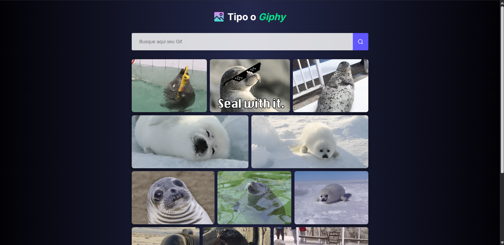

# 🔍 Tipo o Giphy

Uma aplicação web responsiva que realiza buscas de GIFs em tempo real consumindo a API oficial do Giphy, com suporte a paginação via scroll infinito e suporte a dispositivos móveis.

> **Projeto desenvolvido para fins de estudo como parte da jornada de aprendizado do [The Odin Project](https://www.theodinproject.com/).**

---

## 📸 Preview



---

## 🎯 Objetivos do Projeto

- **Requisições de API:** Praticar consumo de APIs REST com `fetch` e manipulação de respostas assíncronas (`async/await`).
- **Programação Orientada a Objetos (POO):** Organização do código dividindo responsabilidades entre serviço de API (`GiphyService`) e controle de interface (`GiphyUi`).
- **Módulos ES6 & Webpack:** Modularização do código e configuração de empacotamento com Webpack (`css-loader`, `style-loader`, `html-loader`).
- **Deploy Otimizado:** Automação da publicação no GitHub Pages via branch dedicada (`gh-pages`).

---

## 🛠️ Tecnologias e Recursos Utilizados

- **HTML5 & CSS3** (Flexbox & Responsividade)
- **JavaScript (ES6+)** (Classes, Módulos, Promises, Async/Await)
- **API do Giphy**
- **Webpack 5** (Module Bundler)
  - `html-webpack-plugin`
  - `html-loader` & `css-loader` / `style-loader`
- **gh-pages** (Deploy automático)

---

## 🚀 Como Executar o Projeto Localmente

1. **Clone o repositório:**
   ```bash
   git clone [https://github.com/thiagoSantz/TipoGiphy.git](https://github.com/thiagoSantz/TipoGiphy.git)
   cd TipoGiphy
   npm install
   npm start
   Acesse a aplicação no seu navegador no endereço: http://localhost:3000

---

## 📦 Scripts Disponíveis

**npm start - Inicia o servidor de desenvolvimento do Webpack.**

**npm run build - Gera os arquivos Otimizados para produção na pasta dist/.**

**npm run deploy - Compila o projeto e atualiza a branch gh-pages no GitHub Pages.**

---

## 🔗 Link do Projeto Online

confira o projeto rodando ao vivo no GitHub Pages:
https://thiagosantz.github.io/TipoGiphy/

---
   
Desenvolvido por Thiago Santz como parte do currículo do The Odin Project 🌱